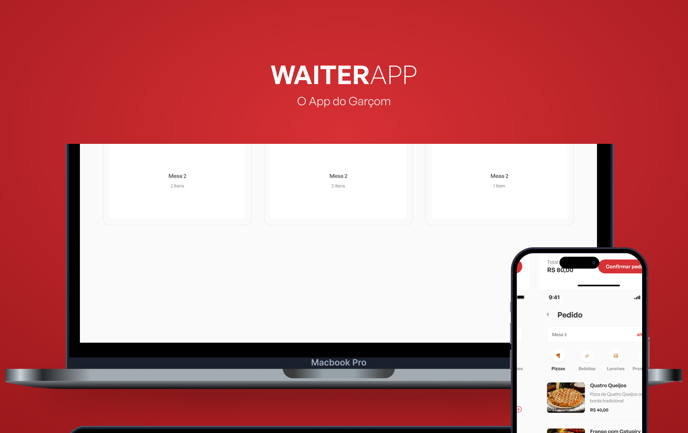

<p align="center">
  
</p>

## 💻 Projeto

Aplicação web em React & Vite.JS para gerenciar os pedidos de um restaurante.

---

## ⚙ Tecnologias

- [TypeScript](https://www.typescriptlang.org/)
- [JavaScript](https://www.javascript.com/)
- [React](https://reactjs.org/)
- [Vite](https://vitejs.dev/)
- E muitas outras…

---

## 📢 Requisitos

- nodejs v16.16.0

Para que esse app funcione corretamente, é preciso estar com o servidor executando.
- Baixe, instale o projeto do ***waiter-app-api*** [aqui](<https://github.com/will-dantas/waiter-app-api>)

---

## 🚀 Como executar

Uma vez com o ***waiter-app-api*** funcionando pode seguir com a instalação do projeto mobile.

- Clone o projeto com:
```
git clone https://github.com/will-dantas/waiter-app-web.git
```
- Instale os pacotes com:
```
yarn install
```
- Para executar o projeto faça:
```
yarn dev
```
Pronto! Se tudo estiver correto você pode vizualizar a aplicação web em na url que o vite gerar para seu projeto.

---

## 🔖 Layout

Você pode visualizar o layout do projeto através do link abaixo:

- [Layout](https://www.figma.com/file/knEXeemC3H55bA462a1zvT/WAITERAPP-(Copy)?node-id=11-195&t=XBFuLxz039jZM1PC-0)

Lembrando que você precisa ter uma conta no [Figma](http://figma.com/).

---

<p align="center">
  Feito por William Dantas
</p>

<p align="center">
  <a href = "mailto:wmdantas2@gmail.com"></a>
<a href="https://www.linkedin.com/in/william-dantas" target="_blank"></a>
</p>
